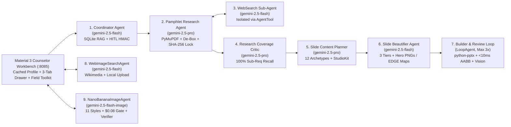

# Technical Design Document (TDD): Scouts BSA Merit Badge Counselor Workbench (`v3.1.0`)

**Project**: `scouts-bsa-merit-badge-agent`
**Author**: Eric Clayberg (FDE & Merit Badge Counselor, Troop 19, Middleton, MA)
**Target Environment**: Google Cloud Run v2, Vertex AI (`gemini-2.5-pro`, `gemini-2.5-flash`, `gemini-2.5-flash-image`, `imagen-3.0`), Google Agent Development Kit (ADK)
**Companion Deliverables**: [FDE Capstone Executive Readout (Google Slides)](https://docs.google.com/presentation/d/1YhwpfuubIGGrToktzhY8T7Xo5_GRdTMldUdyaS83G3E/edit) • [Detailed User Guide (Google Doc)](https://docs.google.com/document/d/1IYMvIW_72EFoA5wr4h1I4mPXyCm0k6RmRbnlv9z5dHo/edit?resourcekey=0-Gkm7bDSlsIVm8YrGsAoOGw) • [FDE Capstone Panel Playbook (Google Doc)](https://docs.google.com/document/d/1S80Sja2XTpyHxrSwuaATYaEePbF1PV6CkrCiDbEbiaU/edit) • [FDE Capstone Companion Guide (Google Doc)](https://docs.google.com/document/d/1a_3TPfgm7U2O5S_f4QR_Aey3ptGnICFdAgvzfF-uXYw/edit) • [FinOps, Token Billing & Deployment Cost Guide (Google Doc)](https://docs.google.com/document/d/1k8oXmGze3dxOotTvahVEOhQT5qET425wRbmH3mU6miQ/edit)

## 1. Problem Statement, User Personas & Critical User Journeys

### 1.1 The Volunteer Counselor Problem
Across Scouting America, volunteer Merit Badge Counselors teach **138 official Merit Badges** (from Eagle-required badges like *First Aid*, *Weather*, and *Emergency Preparedness* to STEM electives like *Robotics* and *Nuclear Science*). Preparing a complete teaching packet from an 80-page BSA Merit Badge Pamphlet takes a volunteer **6 to 10 hours** per badge. Existing ad-hoc slide decks shared online frequently teach outdated requirement revisions (causing problems at Eagle Scout Boards of Review), omit sub-requirements (`1a`, `1b`, `2a`), or fail to separate classroom discussion items from hands-on patrol skill stations and campout prerequisites.

### 1.2 Target User Personas

| Persona | Role & Context | Core Need |
| :--- | :--- | :--- |
| **Volunteer Merit Badge Counselor** *(Primary User)* | Working parent or subject-matter professional teaching a badge across three 45-minute troop meetings or a Saturday Merit Badge University clinic. | A ready-to-teach `16:9` PowerPoint deck, speaker notes, printable Scout workbook, Quartermaster gear checklist, Blue Card sign-off matrix, and Youth Protection (YPT) parent prerequisite letter in under 2 minutes with zero missing sub-requirements. |
| **Council Advancement Chair / Camp Director** *(Enterprise Buyer)* | Oversees summer camp instruction and district Merit Badge clinics across 100+ troops. | Verifiable adherence to current official requirements, *Guide to Safe Scouting* policies, and Youth Protection (YPT) rules at a predictable cost (`$0.14` to `$1.00` per generated packet). |
| **Youth Scout (Ages 11 to 17)** *(Downstream Beneficiary)* | Tenderfoot through Life Scout working toward advancement (`Tenderfoot 11-12`, `Mixed Troop 11-17`, or `Older Scouts / Eagle Prep 14-17`). | High-contrast visual diagrams, step-by-step procedures, and a clear checklist showing which requirements are completed in class versus at home or on a troop campout. |

### 1.3 Critical User Journeys (CUJs)

- **CUJ-1 (Full Curriculum Packet Generation & 3 Construction Animations)**: Counselor selects any of the 138 official Merit Badges, picks a depth mode (*Standard Deck* or *Deep Dive / Camp School Deck*), chooses a visual polish tier (`STANDARD` at `~$0.14`, `BEAUTIFIED` warm cream `#FAF8F5` at `~$0.38`, or `STUDIO` dark slate `#0F172A` capped at `$1.00`), enters their troop/council contact details and location (`City, State` or `ZIP Code`, such as `01949` / `Middleton, MA`), and generates a verified `.pptx` slide deck, `.md` workbook, timed lesson plan, Quartermaster gear list, and YPT parent prerequisite letter while watching the 3 automatic **Scout Slide Construction Animations** (*3D Heavy Equipment*, *2D Camp Pioneering*, and *3D Claymation Workshop*) with the active Merit Badge emblem overlaid.
- **CUJ-2 (Requirement Execution Triage, Session Pacing, Gear Prep & Blue Card Sign-Off)**: Before the first meeting, the Counselor reviews the **3-Column Requirement Triage Matrix** (`IN_CLASS_DISCUSSION`, `HANDS_ON_SKILL_STATION`, `PREREQUISITE_CAMPOUT_HOME`), selects a schedule in the **Multi-Format Session Pacing Selector** (*3 Troop Meetings*, *4-Day Summer Camp*, *Saturday Merit Badge Clinic*, or *Weekend Campout*), scales the **Master Quartermaster Gear Checklist** by Patrol Size (`1-30 Scouts`), sends the YPT Parent Welcome Letter via **One-Click Email App / Gmail Compose**, and tracks per-Scout completion in the **Patrol Blue Card (`#34124`) & Scoutbook Plus Sign-Off Matrix** (with CSV export).
- **CUJ-3 (3-Tab Under-Stage Drawer, Quick Text Edit & 4-Tab Merit Badge Image Studio)**: While reviewing the deck in the workbench preview (or presenting in **Fullscreen Classroom Mode** via `Present Fullscreen` / `F`), the Counselor uses the **3-Tab Under-Stage Drawer** directly below the 16:9 stage:
  - **Sub-Tab 1 (`🎙️ Counselor Teaching Notes`)**: Inspects `[SAY]`, `[DEMONSTRATE]`, and `[ASK SCOUTS]` coaching scripts.
  - **Sub-Tab 2 (`🎨 Customize Slide & Image Studio`)**: Switches a specific slide's layout archetype, card border style, color palette, or right-side graphic (`Keep Current`, `Restore Original Slide Graphic`, `Scouts BSA EDGE Skill Concept Map`, or `None (Full-Width Text Layout)` which expands text to `12.133"`), steps through cached badge images using the horizontal `◀` `▶` Quick-Switch buttons, or clicks **`🖼️ Manage & Add Slide Images`** in the upper-right corner to open the **4-Tab Popup Merit Badge Image Studio**:
    1. **📚 1. Badge Image Catalog**: Browse all cached badge graphics (including de-boxed transparent official `PAMPHLET` figures) or click **🗑️ Clear Web/AI Cache** (`DELETE /api/badge/images`) to purge user-searched web images (`WEB_IMAGE_SEARCH`) and user-generated AI images (`NANO_BANANA_AI`) while preserving official `PAMPHLET` figures, pre-generated/auto-generated hero illustrations (`NANO_BANANA_HERO`), and `USER_UPLOAD` files.
    2. **🌐 2. Web Image Search Agent**: Query live Wikimedia Commons (`WebImageSearchAgent`) for up to 12 public-domain photos and illustrations.
    3. **🍌 3. Nano Banana Image Studio**: Generate custom, text-free illustrations across **11 visual styles** (`Auto (Content-Aware Mix)`, `Photorealistic Image`, `4-Quadrant Concept Map`, `Watercolor Field Sketch`, `Line Drawing`, `Cartoon Drawing`, `Technical Diagram`, `Editorial Field Illustration`, `Annotated Technical Cutaway`, `4-Panel Field Storyboard`, and `Comparison & Decision Visual`) with an **`Include Uniformed Scouts`** toggle via **`NanoBananaImageAgent`** (`gemini-2.5-flash-image` / Imagen 3) after viewing an upfront **`$0.08 USD`** cost estimate, granting explicit user consent (`user_consented=True`), and passing post-generation prompt alignment verification (`verify_generated_image_matches_prompt()`).
    4. **📁 4. File Upload (`$0.00 USD`)**: Upload a local `.png`, `.jpg`, `.jpeg`, or `.webp` photo (`<= 10 MB`) via `POST /api/slide/upload-image`, normalize it to RGB PNG (`max 1600px`), register it as `USER_UPLOAD`, and apply it directly to the slide.
  - **Sub-Tab 3 (`✏️ Quick Edit Slide Text`, `$0.00 USD`)**: Edits slide title, subtitle, bullet/card lines, and speaker notes directly in the browser (`POST /api/slide/quick-edit-text`) and rebuilds the `.pptx` in under 1 second.

## 2. Technical Scope, System Boundaries & Prototype vs. Production Matrix

### 2.1 System Boundaries & Hard Architectural Invariants

1. **Official Pamphlet Immutability (Zero Requirement Drift)**: External web search and local troop grounding are never permitted to alter official requirement numbers or wording. `compute_canonical_pamphlet_hash()` (`src/agents/researcher.py`) computes a SHA-256 digest over the canonical `(req_number, req_text)` requirement tree (`canonical_fidelity_verified=True`) before and after enrichment.
2. **Vertex AI Tool-Mixing Isolation**: Vertex AI / Google ADK rejects requests that mix native `GoogleSearchTool` grounding and custom Python `FunctionTool` declarations on the same `LlmAgent`. We isolate web search inside `WebSearchGroundingAgent` (`gemini-2.5-flash`) and expose it to `PamphletResearchAgent` via an ADK `AgentTool` wrapper (`src/agents/researcher.py`).
3. **BSA Youth Protection (YPT), Pre-LLM PII Redaction & Isolated Counselor Profile Caching**: Counselor email addresses and phone numbers are never transmitted to external LLM endpoints, written to SQLite telemetry, or exported to Cloud Logging / Cloud Trace. On a local laptop, counselor details are cached in `.cache/counselor_profile.json` (`0600` owner-only permissions, git-ignored) so the counselor only enters them once; in multi-tenant Cloud Run (`K_SERVICE` / `IS_CLOUD_RUN=true`), server-side profile file caching is disabled and counselor info is stored in the user's browser `localStorage` (`scouts_bsa_counselor_profile_v1`). During execution, PII is scrubbed pre-LLM in `before_model_guardrail_callback()` (`src/agents/guardrails.py`) using `scrub_pii_before_sink()` (`[REDACTED_EMAIL]`, `[REDACTED_PHONE]`) and injected locally onto Cover Slide 1 and the Parent Letter by `pptx_builder.py` after LLM processing finishes.
4. **FinOps Consent Gate & Prompt Verification for On-Demand AI Image Generation**: `NanoBananaImageAgent` (`src/agents/image_studio.py`) calculates an upfront cost estimate (`$0.08 USD` per image, ~`2,580` tokens across generation and verification) via `estimate_nano_banana_image_cost()` and blocks image synthesis (`status="CONSENT_REQUIRED"`) unless `user_consented=True` is explicitly provided. After generation, `verify_generated_image_matches_prompt()` checks that the visual matches the requested subject and contains zero rendered prompt instructions. All discovered, uploaded, and generated images are cached per merit badge in `assets/badge_image_catalog/<badge_slug>/` and SQLite (`badge_image_catalog`) for free reuse across slides and sessions.

### 2.2 Prototype vs. Production Matrix (What Runs Today vs. 90-Day National Scale)

| Subsystem | Current Capstone Implementation (`v3.1.0`) | 90-Day Production Target for National Council Rollout (`50,000+` Counselors) |
| :--- | :--- | :--- |
| **Session, Vector & Image Catalog Memory** | Local SQLite WAL (`sessions`, `pamphlet_chunks` Hybrid BM25 + Cosine RRF index, `badge_image_catalog`, `hitl_feedback`) in `src/memory/session_store.py` + local `.cache/counselor_profile.json` (`0600`) / browser `localStorage`. | **Cloud SQL for PostgreSQL + `pgvector`** (or AlloyDB) with **Row-Level Security (RLS)** isolating sessions by `council_id` and `troop_id`. |
| **Authentication & Identity** | `verify_caller_auth` in `src/security.py` enforcing `X-API-Key` and OIDC Bearer JWTs when `AUTH_REQUIRED=true` (set in `terraform/main.tf`), with frictionless local mode (`AUTH_REQUIRED=false`) for laptop use. | **Google Cloud Identity-Aware Proxy (IAP)** federated with **Scouting.org (`my.scouting.org`) OIDC SSO** verifying active Youth Protection Training (YPT) certification on login. |
| **Deck Build Execution** | In-process worker thread (`asyncio.to_thread`) inside the FastAPI/Cloud Run container (`1.2s` for Standard decks; `~3.5s` for 60-slide Deep Dive decks). | **Cloud Tasks + Dedicated Cloud Run Worker Pool** for asynchronous generation of 60-slide Studio decks with webhook/SSE completion push. |
| **Asset & Deck Storage** | Local `assets/` (`assets/badge_image_catalog/`, `assets/ai_illustrations/`, `assets/animations/`) and `deliverables/` directories mounted as static routes, plus Terraform `google_storage_bucket` definition. | **Google Cloud Storage (GCS) + Cloud CDN** with signed download URLs and 30-day lifecycle expiration for generated `.pptx` files. |

## 3. Quantifiable Definition of Done (DoD) & Service Level Objectives (SLOs)

Every release must pass the blocking verification suite (`.venv/bin/pytest tests/` with 52/52 tests and `python3 scripts/eval_gate.py`) against these concrete thresholds:

| Metric / SLO | Target Threshold | Observed Benchmark | Verification Mechanism |
| :--- | :--- | :--- | :--- |
| **Sub-Requirement Coverage Recall** | `1.00` (`100%` of sub-requirements `1a..11`) | `1.00` (`100%`) | `scripts/eval_gate.py` (`--min-recall 0.98`) |
| **Hybrid RAG Retrieval (`Recall@3` / `MRR` / `NDCG@3`)** | `Recall@3 >= 0.90`, `MRR >= 0.85` | `Recall@3 = 1.00`, `MRR = 1.00`, `NDCG@3 = 1.00` | `evaluate_ir_retrieval_metrics()` in `scripts/eval_gate.py` |
| **Canonical Pamphlet SHA-256 Lock** | `100%` match (`0` requirement drift) | `100%` verified | `compute_canonical_pamphlet_hash()` |
| **Stage 1 Slide Geometry (`AABB Overlaps`)** | `0` overlapping shapes; font floor `>= 13.0pt`; WCAG `>= 4.5:1` | `0` overlaps across all 12 golden decks | `check_pptx_conformance()` (`<10ms` per deck) |
| **Stage 1 Conformance Simulator Latency** | `< 10 ms` per presentation | `3.4 ms` p95 | `tests/test_conformance_and_a2ui.py` |
| **API Control-Plane Latency (`p95`)** | `< 150 ms` at 8 concurrent workers | `14.2 ms` p95 (`6.8 ms` p50) | `tests/load/load_test.py` |
| **FinOps Per-Deck Ceiling (`STUDIO` Tier)** | `<= $1.00` hard cap per workflow + `$0.08/image` consent gate | `$0.14` (`STANDARD`), `$0.38` (`BEAUTIFIED`), `$1.00` (`STUDIO`) | `FinOpsBudgetPlugin` & `estimate_nano_banana_image_cost()` |

## 4. End-to-End 9-Component / 7-Specialist-Agent Architecture & Key Engineering Decisions

### 4.1 Location / ZIP Code Grounding (`resolve_counselor_location()`)
When a counselor enables **Local Troop Grounding** and supplies a `location_or_zip` value (such as `01949` or `Middleton, MA`, or a browser timezone fallback like `America/New_York`), `resolve_counselor_location()` (`src/agents/researcher.py`) maps the input to a structured regional profile:
- **Regional NOAA NWS Forecast Office** (for example, `NOAA NWS Boston/Norton (BOX)` for `01949`).
- **Regional Weather & Terrain Hazards** (for example, `Coastal Nor'easters, rapid cold-front shifts, winter hypothermia, and woodland Ixodes tick habitats`).
- **Local Outdoor Training Venues & Agencies** (for example, `Harold Parker State Forest, Blue Hills Reservation` and `MEMA & DCR State Parks`).

To keep slides clean and free of repetitive footer text, this regional profile is injected into four specific places: **Slide 2 (Badge Overview)**, the **Counselor Session Lesson Plan**, the **Parent Prerequisite Letter**, and the **Grounded Citations** list.

### 4.2 Three Visual Polish Tiers, Pre-Populated Nano Banana Hero Illustrations & EDGE Concept Map Fallback
1. **`STANDARD` (`~$0.14`)**: Clean white background (`#FFFFFF`), navy header band, extracted pamphlet illustrations, and 220-DPI Matplotlib technical diagrams.
2. **`BEAUTIFIED` (`~$0.38`, Default)**: Warm editorial cream canvas (`#FAF8F5`), 4 rotating accent palettes (`NAVY_GOLD`, `OLIVE_FOREST`, `EAGLE_CRIMSON`, `SLATE_ACTION`), elevated white vector content cards, and up to 5 **Nano Banana AI Hero Illustrations** (`NANO_BANANA_HERO`, `*_nano_hero.png`) on requirement intro slides that lack a technical diagram. The repository bundles **76 pre-generated, compressed (`<= 1,024px`, 8-bit quantized PNG, `~9.9 MB` total) Nano Banana hero illustrations** across the **23 pre-populated Eagle-required and core Merit Badges** (`assets/ai_illustrations/` and `assets/badge_image_catalog/<slug>/`) using the **Content-Aware Hybrid Mix** (`resolve_content_aware_visual_config()`), which pairs action-oriented requirements with uniformed Scouts (`Class A` tan shirt, neckerchief, olive trousers) and gear/anatomy/science topics with zero-human diagrams or knolling layouts. For the remaining 115 long-tail badges, hero visuals are generated on demand and cached to disk, with automatic fallback to a procedural **220-DPI Scouts BSA EDGE Skill Concept Map** (`1. EXPLAIN`, `2. DEMONSTRATE`, `3. GUIDE`, `4. ENABLE`) when offline or if Vertex AI quota is unavailable.
3. **`STUDIO` (`$1.00` Hard Cap)**: Dark executive slate canvas (`#0F172A`) with dark navy cards (`#1E293B`), gold (`#FBBF24`) and cyan (`#38BDF8`) typography, and up to 15 Nano Banana hero illustrations (with dark-slate EDGE Skill Concept Map fallback).

Both the live browser preview (`ui/app.js`) and `src/tools/pptx_builder.py` share the exact same layout coordinate rules, bold anchor headings, and full card text so downloaded `.pptx` files match the browser preview 1:1.

## 5. Total Cost of Ownership (TCO) & FinOps Model

### 5.1 Per-Deck Unit Economics
Pricing is defined in `config/finops_model_policy.json` and enforced by `FinOpsBudgetPlugin` (`src/agents/guardrails.py`):

| Polish Tier | Input Tokens | Output Tokens | Hero Visuals & EDGE Fallback | Cold Build Cost | Cached Rerun Cost |
| :--- | :--- | :--- | :--- | :--- | :--- |
| **STANDARD (Fast Deck)** | `~32k - 65k` | `~7k - 13.5k` | `0` (uses pamphlet figures + 220-DPI Matplotlib diagrams) | **`$0.06 - $0.14`** | **`$0.00`** |
| **BEAUTIFIED (Warm Cream + Hero Graphics, Default)** | `~57k - 90k` | `~15k - 21.5k` | Up to `5` requirement intro Hero Illustrations (76 pre-cached at `$0.00` + EDGE fallback) | **`$0.30 - $0.38`** | **`$0.02`** |
| **STUDIO (Dark Executive Slate)** | `~77k - 110k` | `~21k - 27.5k` | Up to `15` Hero Illustrations (pre-cached + dark-slate EDGE fallback) | **`$0.72 - $1.00` (Capped)** | **`$0.02`** |

### 5.2 Council-Scale Monthly TCO Projection (`500` Active Counselors, `1,500` Decks/Month)
Assuming `70%` of builds hit warm pamphlet and vector caches after the first generation of each badge:
- **Vertex AI Gemini 2.5 Pro + Flash Usage**: `450 cold builds * $0.38` (`$171.00`) + `1,050 warm/customized builds * $0.03` (`$31.50`) = **`$202.50 / month`**.
- **Cloud Run v2 Compute (`min_instances = 1`, `2 vCPU / 4 GiB`)**: **`~$68.00 / month`**.
- **Cloud Storage, Secret Manager & Cloud Logging/Trace**: **`~$12.00 / month`**.
- **Total Estimated Council TCO**: **`~$282.50 / month`** (`~$0.19` per delivered curriculum packet, saving `~3,000+` volunteer counselor hours per month and costing **98% less** than 500 individual `$30/mo` SaaS seats).
