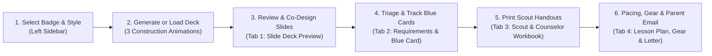
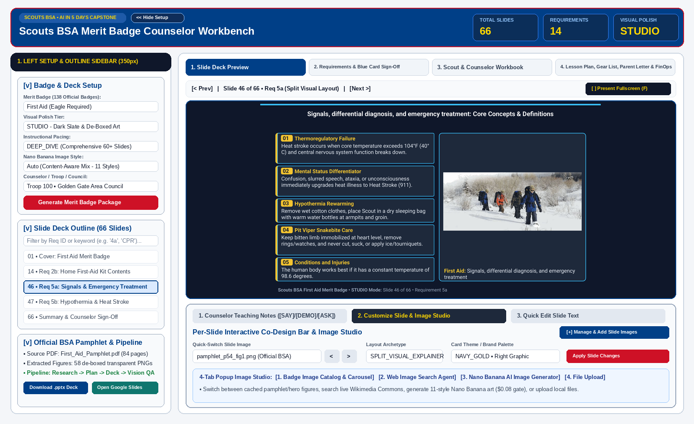
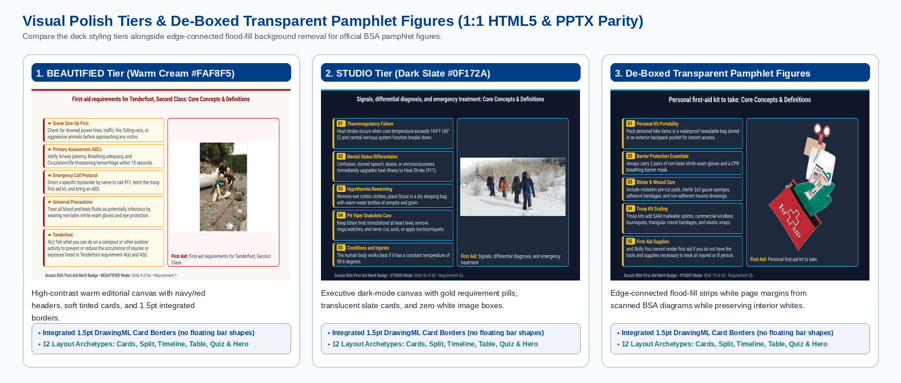
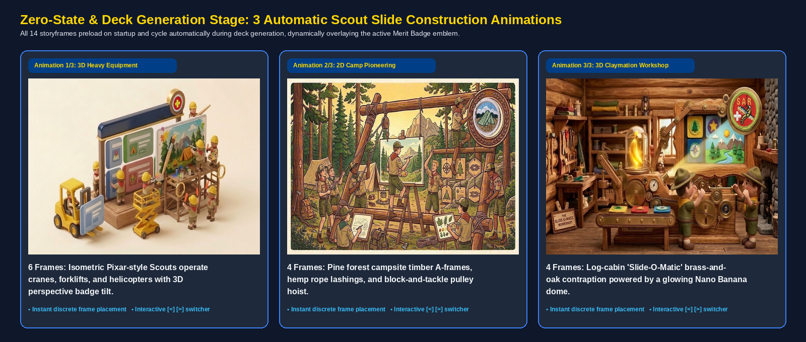
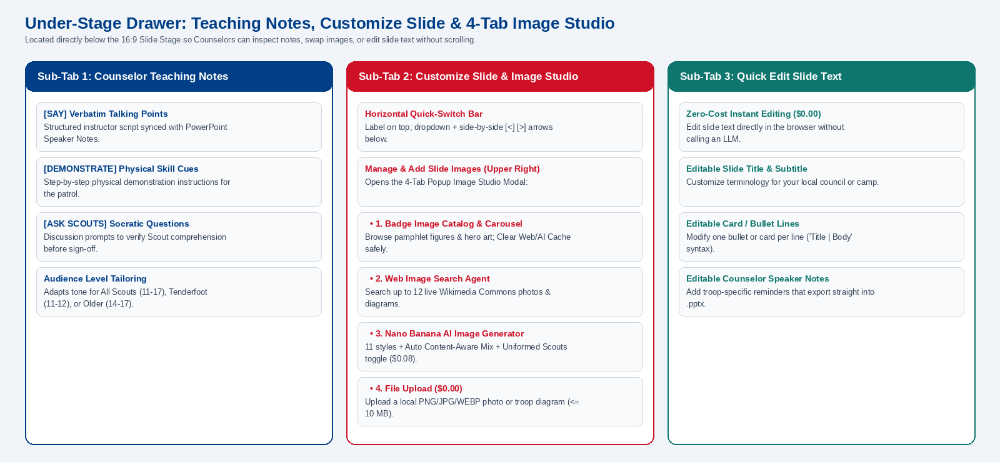
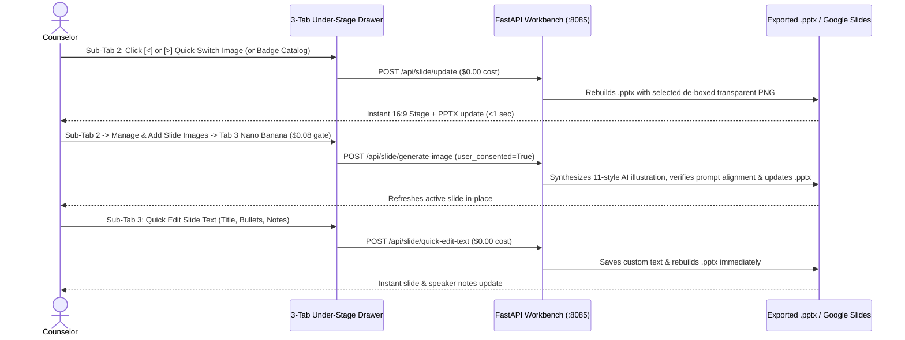
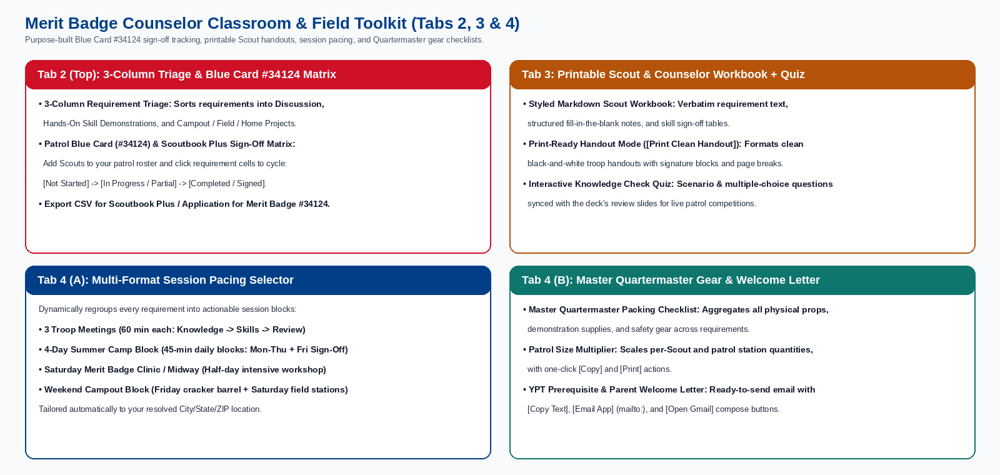

# Scouts BSA Merit Badge Counselor Workbench: Detailed User Guide

This guide walks Merit Badge Counselors, Camp Directors, and Advancement Chairs through every screen, option, and classroom tool in the **Scouts BSA Merit Badge Counselor Workbench**.

Whether you are preparing for three 60-minute evening troop meetings, a four-day summer camp block, a weekend campout, or a Saturday Merit Badge Midway clinic, the workbench turns official Scouts BSA requirements and pamphlets into a complete teaching package: a widescreen (`16:9`) PowerPoint (`.pptx`) presentation, a printable Scout workbook (`.md`), a multi-format session pacing plan, a Quartermaster gear checklist, a Youth Protection (YPT) parent welcome letter, and a Blue Card (`#34124`) / Scoutbook Plus sign-off tracker.

---

## 1. Quick-Start Workflow at a Glance





---

## 2. Launching the Workbench & Navigating the Interface

Start the workbench locally on port `8085`:

```bash
./run_local.sh
```

Open **`http://localhost:8085`** in your browser (or open the live Cloud Run URL). The interface uses a responsive two-column layout designed for standard 13-inch to 16-inch laptops as well as classroom projectors:

| Interface Region | Location | Purpose |
| :--- | :--- | :--- |
| **Top Hero Banner** | Full width across the top | Displays the active badge title, the **`◀ Hide Setup` / `▶ Show Setup`** sidebar toggle button, direct links to the **Official BSA Pamphlet (PDF)** and **Scouting.org Resource Guide**, download buttons for the **Workbook (`.MD`)** and **Slide Deck (`.PPTX`)**, and three horizontal metric pills (**`TOTAL SLIDES`**, **`REQUIREMENTS`**, and **`VISUAL POLISH`**). |
| **Left Setup & Outline Sidebar (`350px`)** | Left column (collapsible) | Houses three collapsible accordions: **1. Find & Select Merit Badge**, **2. Deck Style & Counselor Info**, and **3. Slide Deck Outline & Generation Progress**. |
| **4 Top-Level Stage Tabs** | Top of the right main workspace | Switches cleanly between **1. Slide Deck Preview**, **2. Requirements & Blue Card Sign-Off**, **3. Scout & Counselor Workbook**, and **4. Lesson Plan, Gear List, Parent Letter & FinOps** without stacking long vertical pages. |
| **16:9 Widescreen Slide Stage** | Center of Tab 1 (*Slide Deck Preview*) | Renders the active slide at a true 16:9 aspect ratio with 1:1 visual parity against the exported PowerPoint and Google Slides deck. Includes a **`Present Fullscreen (F)`** mode for classroom projection. |
| **3-Tab Under-Stage Drawer** | Directly below the 16:9 Slide Stage | Provides instant access to **1. Counselor Teaching Notes (`[SAY]` / `[DEMO]` / `[ASK]`)**, **2. Customize Slide & Image Studio**, and **3. Quick Edit Slide Text** without scrolling away from the slide canvas. |

> **Projector Tip**: Click **`◀ Hide Setup`** in the upper-left corner of the top blue banner (right next to the `SCOUTS BSA • AI IN 5 DAYS CAPSTONE` pill) before projecting to your patrol. The left sidebar collapses completely so the 16:9 slide stage fills the screen, and the button label changes to **`▶ Show Setup`**.

---

## 3. Step 1: Configuring Your Badge, Visual Polish & Counselor Profile

Use the first two accordions in the left sidebar to select your badge and configure your curriculum package:

### 3.1 Finding & Selecting a Merit Badge (`138` Official Badges)
In the **1. Find & Select Merit Badge** accordion:
- **Search Merit Badge Name**: Filter all **138 official Scouts BSA Merit Badges** (18 Eagle-Required and 120 Elective) by keyword (such as `First Aid`, `Weather`, `Cooking`, `Camping`, `Search and Rescue`, `Pioneering`, `Robotics`, or `Kayaking`).
- **Category & Eagle Status Filters**: Narrow the catalog by Scouting category (*Outdoor & Campcraft*, *Health & Public Safety*, *Citizenship & Personal Development*, *Nature & Environment*, *STEM & Science*, *Aquatics & Sports*, *Trades, Business & Careers*) or filter by **Eagle-Required** vs. **Elective**.
- **Quick-Select Pills**: Click any of the 8 popular troop badge pills to load its curriculum immediately.

### 3.2 Selecting a Visual Polish Tier (`STANDARD`, `BEAUTIFIED`, `STUDIO`)



In the **2. Deck Style & Counselor Info** accordion, choose the **Slide Visual Polish Mode** that best matches your teaching environment:

| Visual Polish Tier | Canvas Background | Card & Border Styling | Best Used For |
| :--- | :--- | :--- | :--- |
| **`STANDARD` (`~$0.14 / deck`)** | Crisp White (`#FFFFFF`) | Classic Scouts BSA Navy (`#003F87`) and Scarlet (`#CE1126`) headers with light neutral cards and extracted pamphlet figures + 220-DPI technical diagrams. | Brightly lit classrooms, church fellowship halls, or black-and-white/color paper printing. |
| **`BEAUTIFIED` (`~$0.38 / deck`, Default)** | Warm Editorial Cream (`#FAF8F5`) | Tinted cards (`#F0F5FF`, `#F0FDF4`, `#FFF1F2`) with integrated `1.5pt` DrawingML accent borders, rotating accent palettes (`NAVY_GOLD`, `OLIVE_FOREST`, `EAGLE_CRIMSON`, `SLATE_ACTION`), and up to 5 Nano Banana Hero Illustrations (`NANO_BANANA_HERO`). | Laptop screen sharing, troop meeting rooms, and daytime camp pavilions. |
| **`STUDIO` (`$1.00 Budget`)** | Deep Executive Slate (`#0F172A`) | High-contrast dark slate cards (`#1E293B`), gold and cyan headers (`#FFD700`), up to 15 Nano Banana Hero Illustrations / dark-slate EDGE Skill Concept Maps, and de-boxed transparent pamphlet illustrations. | Evening campfires, darkened auditoriums, and large HDMI/wireless projectors. |

> **De-Boxed Transparent Pamphlet Figures**: Scanned illustrations extracted from official BSA Merit Badge Pamphlet PDFs automatically pass through an edge-connected flood-fill background remover (`debox_pamphlet_image_file()`). This strips the surrounding white page box so the figure's background is transparent against both the warm cream (`BEAUTIFIED`) and dark slate (`STUDIO`) slide canvases while keeping interior white highlights (such as gauze pads or eye whites) intact.

### 3.3 Choosing Deck Depth & Target Audience Level
- **Slide Deck Length & Depth**:
  - **Deep Dive Teaching Deck (50 to 70+ slides)**: Multi-slide teaching sequences for every sub-requirement (`1a`, `1b`, `2a`, `2b`, etc.), including a Requirement Intro slide, concept explainers, two-column comparisons, worked examples, 220-DPI diagrams, and Socratic review questions.
  - **Standard Troop Meeting Deck (16 to 28 slides)**: Concise 1 to 3 slide sequences per requirement for a single-evening overview or patrol breakout.
- **Target Scout Audience Level**:
  - Choose **All Scouts (Ages 11–17)**, **First-Year / Tenderfoot Focus (Ages 11–12)**, or **Older Scouts / Eagle Prep (Ages 14–17)** to tailor the `[SAY]`, `[DEMONSTRATE]`, and `[ASK SCOUTS]` coaching notes.

### 3.4 Saving Your Counselor Profile, Local Grounding & Custom Logo
Fill in your **Counselor Name**, **Troop & Council Affiliation**, **Location (City, State or ZIP Code)**, **Contact Email**, **Contact Phone**, and optional **Troop Custom Logo (`.png` / `.jpg`)**:
- **Location-Aware Local Troop Grounding**: `resolve_counselor_location()` uses your ZIP code or City/State (or infers it from your Troop/Council text or browser timezone) to ground Slide 2, the Lesson Plan, the Parent Letter, and Grounded Citations in your local NOAA National Weather Service office, regional terrain hazards, state parks, and state agencies.
- **Automatic Caching & PII Redaction**: On local laptop runs, your profile is saved in `.cache/counselor_profile.json` (`0600` owner-only permissions). On multi-tenant Cloud Run deployments, it is stored in your browser's `localStorage` (`scouts_bsa_counselor_profile_v1`). Contact PII is injected only into the local Cover Slide and Parent Letter templates and is scrubbed by `ScoutsBSAModelArmorPlugin` and `scrub_pii_before_sink()` before any LLM call or telemetry sink. Click **`Reset Saved Info`** anytime to clear your saved profile.

---

## 4. Step 2: Generating a Package & Watching the 3 Construction Animations

Click **`Generate Slide Deck & Workbook`** to run the multi-agent pipeline (`MeritBadgeCoordinatorAgent` orchestrating `PamphletResearchAgent`, `DeepResearchEnrichmentAgent`, `SlideContentPlannerAgent`, `SlideBeautifierAgent`, `PowerPointBuilderAgent`, and `BSABrandAndSafetyReviewAgent`).



While a deck is being built (or in the initial zero-state before selecting a badge), the slide preview area hides and displays the **Scout Slide Construction Showcase**:
- **Proactive Startup Preloading**: All 14 animation storyframes preload into browser memory when the app initializes so frames step cleanly with zero network stall.
- **Automatic 3-Animation Rotation with Live Badge Emblem Overlay**:
  1. **Animation 1/3: 3D Heavy Equipment** (6 frames): Isometric Pixar-style Scouts in tan uniforms and yellow hardhats operate mini-bulldozers, tower cranes, forklifts, and a twin-rotor cargo helicopter to construct a giant 16:9 slide. On frames 1–3, the active Merit Badge emblem rests on the ground with an isometric 3D tilt (`perspective(500px) rotateX(56deg) rotateZ(-28deg)`); on frame 4 the helicopter hoists it into position; on frames 5–6 it locks into the upper-right mounting ring.
  2. **Animation 2/3: 2D Camp Pioneering** (4 frames): Scouts at a pine forest campsite lash timber spars, hoist a canvas projection screen with block-and-tackle pulleys, paint the visual panel, and light a twilight campfire premiere with the Merit Badge emblem centered inside the carved wooden medallion ring.
  3. **Animation 3/3: 3D Claymation Workshop** (4 frames): Stop-motion clay Scouts feed Merit Badge pamphlets into a brass-and-oak *"Slide-O-Matic"* contraption powered by a glowing golden Nano Banana energy dome.
- **Instant Discrete Emblem Placement & Manual Controls**: When stepping from frame to frame, the Merit Badge emblem appears in its new coordinate slot immediately without sliding across the canvas. You can also step between `Animation 1/3`, `Animation 2/3`, and `Animation 3/3` manually using the **`◀` / `▶`** controls.

---

## 5. Step 3: Mastering Tab 1: Slide Deck Preview, Fullscreen Mode & Under-Stage Drawer

Once your package loads, **Tab 1 (`Slide Deck Preview`)** is your primary slide review and classroom presentation workspace.

### 5.1 Navigating Slides, Filtering the Outline & Presenting Fullscreen
- **Keyboard Shortcuts**:
  - Press **`←`** (Left Arrow) or **`→`** (Right Arrow) to step backward or forward through the deck.
  - Press **`F`** (or click **`Present Fullscreen`** in the slide header bar) to launch **Fullscreen Classroom Presentation Mode**. Even if a browser iframe restricts the native HTML5 Fullscreen API, the workbench automatically engages a full-viewport (`100vw × 100vh`) dark presentation stage with floating **`◀ Prev`**, **`Next ▶`**, and **`✕ Exit Fullscreen (Esc)`** controls.
- **Slide Deck Outline Search**: In the left sidebar's **3. Slide Deck Outline** accordion, type a requirement number (such as `2b` or `9a`) or a topic keyword (such as `tourniquet`, `hypothermia`, or `stove`) to filter the slide filmstrip and jump directly to that slide.

### 5.2 Using the 3-Tab Under-Stage Drawer



Directly below the 16:9 slide stage, three horizontal sub-tabs let you inspect coaching notes, customize visuals, and edit slide text without scrolling:



#### Sub-Tab 1: `🎙️ Counselor Teaching Notes ([SAY] / [DEMO] / [ASK])`
Displays the slide's structured instructor script, which is also written into the exported PowerPoint's native **Speaker Notes** pane:
- **`[SAY]`**: Clear, age-appropriate explanation points to share with the patrol.
- **`[DEMONSTRATE]`**: Physical hands-on demonstration steps using the EDGE method (*Explain, Demonstrate, Guide, Enable*).
- **`[ASK SCOUTS]`**: Socratic check-for-understanding questions to ask before signing off the requirement.

#### Sub-Tab 2: `🎨 Customize Slide & Image Studio`
Gives you complete layout and visual control over the active slide:
1. **Quick-Switch Slide Image (`◀` / `▶`)**: Located on the left side of the co-design bar with the label stacked cleanly above the dropdown and side-by-side **`◀` `▶`** arrow buttons immediately after the list. Click **`◀`** or **`▶`** to step through all cached images for the badge at **`$0.00` cost**.
2. **Layout Archetype, Card Theme, Brand Palette & Right-Side Graphic Controls**:
   - Change the slide's **Layout Archetype** (across 12 archetypes including `SPLIT_VISUAL_EXPLAINER`, `CONCEPT_TEXT_SLIDE`, `COMPARISON_TWO_COLUMN`, `WORKED_EXAMPLE_CARD`, `TIMELINE_STEP_FLOW`, and `SOCRATIC_REVIEW_QUIZ`), **Card Theme**, or **Brand Palette** (`NAVY_GOLD`, `OLIVE_FOREST`, `EAGLE_CRIMSON`, `SLATE_ACTION`).
   - Set **Right-Side Graphic** to **Keep Current Slide Graphic**, **Restore Original Slide Graphic**, **Nano Banana Hero / EDGE Skill Concept Map**, or **None (Remove Graphic & Expand Text to Full Width)**.
3. **`🖼️ Manage & Add Slide Images` Button (Upper-Right Corner)**: Clicking **`Manage & Add Slide Images`** in the upper-right header of the Co-Design bar opens the **4-Tab Popup Image Studio Modal**:
   - **🗂️ 1. Badge Image Catalog & Carousel**: Browse every cached image for the active Merit Badge and apply any image in one click. Includes a **`🗑️ Clear Web/AI Cache`** button that purges only user-searched web images (`WEB_IMAGE_SEARCH`) and user-created AI images (`NANO_BANANA_AI`) while preserving official pamphlet figures (`PAMPHLET`), pre-generated/auto hero illustrations (`NANO_BANANA_HERO`), and local uploads (`USER_UPLOAD`).
   - **🌐 2. Web Image Search Agent (`gemini-2.5-flash`)**: Queries the live Wikimedia Commons API for up to 12 public-domain photographs and diagrams matching your topic, caches selected results, and applies them to the current slide.
   - **🍌 3. Nano Banana AI Image Generator (`$0.08` Consent Gate)**: Synthesizes custom, text-free illustrations across **11 visual styles**, defaulting to **`Auto (Content-Aware Mix)`** (which inspects the slide title and bullet text to pick the best visual style and human/no-human routing):

| Nano Banana Style Option | Visual Description | Best Match |
| :--- | :--- | :--- |
| **`Auto (Content-Aware Mix)`** *(Default)* | Automatically selects the best style and human/gear framing based on slide title and bullet text via `resolve_content_aware_visual_config()`. | General slide visual creation across medical, outdoor, and gear topics. |
| **`Photorealistic Image`** | Natural outdoor photography with crisp depth of field. | Campcraft scenes, weather observation, and field skills. |
| **`4-Quadrant Concept Map`** | 4-panel visual summary grid with distinct thematic icons. | Requirement overviews, safety pillars, and EDGE coaching steps. |
| **`Watercolor Field Sketch`** | Hand-painted botanical and naturalist field manual artwork. | Plants, wildlife, cloud types, and habitat identification. |
| **`Line Drawing`** | Classic black-and-sepia ink engraving modeled after vintage Scouting handbooks. | Knots, lashings, splint wrapping, and printable diagrams. |
| **`Cartoon Drawing`** | Friendly, approachable cel-shaded illustration for younger Scouts. | Buddy system rules, camp etiquette, and scenarios. |
| **`Technical Diagram`** | Clean schematic diagram showing spatial geometry and vectors. | 200-foot bear bag triangle, compass declination, and circuit layouts. |
| **`Editorial Field Illustration`** | Warm National Park poster / editorial outdoor illustration. | Cover slides, requirement intro headers, and conservation themes. |
| **`Annotated Technical Cutaway`** | Cross-sectional cutaway showing internal layers with leader lines (zero text). | Water filters, camp stoves, first-aid blister layers, and shelters. |
| **`4-Panel Field Storyboard`** | Sequential 4-frame action progression (Before → Action → Check → Result). | Emergency triage (`Check -> Call -> Care`), rescue throws, and stove lighting. |
| **`Comparison & Decision Visual`** | Side-by-side split visual contrasting correct vs. incorrect or Type A vs. Type B. | Heat exhaustion vs. heat stroke, venomous vs. non-venomous snakes, knot comparisons. |

   - **Include Uniformed Scouts Toggle**: Choose whether human figures appear in authentic **Scouts BSA Field Uniforms** (tan shirt, neckerchief with woggle slide, olive trousers) or render **zero human figures** for pure equipment knolling, anatomy/kits, or weather diagrams.
   - **📁 4. File Upload (`$0.00 USD`)**: Upload a local `.png`, `.jpg`, `.jpeg`, or `.webp` image (`<= 10 MB`) from your computer to apply directly to the active slide and embed into the `.pptx`.

#### Sub-Tab 3: `✏️ Quick Edit Slide Text` (`$0.00` Instant Edit)
Need to customize wording for your troop, add a local camp rule, or tweak a bullet point without running an AI call?
- Open **Sub-Tab 3 (`Quick Edit Slide Text`)** to edit the slide's **Title**, **Subtitle**, **Bullets / Cards** (one item per line; use `Heading | Description` for titled cards), and **Counselor Speaker Notes**.
- Click **`Save Slide Text ($0.00)`** to update both the live 16:9 web preview and the downloadable `.pptx` file in under one second.

---

## 6. Step 4: Using the Counselor Classroom & Field Toolkit (Tabs 2–4)

Beyond the slide deck, the remaining top-level stage tabs provide practical classroom and field logistics tools built specifically for BSA Merit Badge Counselors.



### 6.1 Tab 2: `Requirements & Blue Card Sign-Off`
**Tab 2** combines requirement classification with live patrol progress tracking:
1. **3-Column Requirement Triage Matrix**:
   - Automatically sorts every official requirement into **1. Discussion & Core Knowledge**, **2. Hands-On Skill Demonstrations**, and **3. Campout, Field & Home Projects** so you can see at a glance which requirements can be completed in a classroom vs. outdoors.
2. **Patrol Blue Card (`#34124`) & Scoutbook Plus Sign-Off Matrix**:
   - **Build Your Patrol Roster**: Enter a Scout's name, Troop number, and Patrol name, then click **`+ Add Scout`** (or click **`Load Sample Patrol`** to test). Roster state persists automatically in your browser's `localStorage`.
   - **Click-to-Cycle Requirement Cells**: Every official requirement and sub-requirement (`1`, `2a`, `2b`, etc.) appears as a column across the matrix. Click any cell to cycle its status:
     - **`⬜ Not Started`** → **`⏳ In Progress / Partial`** → **`✅ Completed / Signed Off`**.
   - **Bulk Sign-Off Actions**: Mark an entire requirement column complete after a group skill station, or sign off all requirements for an individual Scout.
   - **Export CSV for Scoutbook Plus & Blue Card `#34124`**: Click **`⬇ Export Scoutbook CSV`** to download a timestamped `.csv` spreadsheet listing every Scout, their unit/patrol, their completion status on every sub-requirement, overall completion percentage (`Complete` vs. `Partial`), Counselor metadata, and session date. Troop Advancement Chairs can import or transcribe this directly into **Scoutbook Plus** (`advancements.scouting.org`) or paper **Application for Merit Badge (`#34124`)** Blue Cards.

### 6.2 Tab 3: `Scout & Counselor Workbook` (Print-Ready Handouts & Quiz)
**Tab 3** provides structured materials for Scouts to use during and after the session:
- **Styled Markdown Scout Workbook**: Displays verbatim requirements, structured fill-in-the-blank note sections, skill sign-off tables, and prerequisite checklists.
- **Print-Ready Scout Handout (`🖨️ Print Handout / Worksheet`)**: Click **`Print Handout / Worksheet`** to open a clean black-and-white print view formatted with Scout Name / Troop / Date header lines, write-in answer boxes, and Counselor signature blocks so you can print copies for the entire patrol or save as a PDF.
- **Download Raw `.MD`**: Click **`Workbook (.MD)`** in the top bar anytime to download the raw Markdown file.

### 6.3 Tab 4: `Lesson Plan, Gear List, Parent Letter & FinOps`
**Tab 4** prepares your session schedule, physical equipment, parent communications, and cost accounting:

1. **Multi-Format Session Pacing Selector & Counselor Lesson Plan**:
   - Use the **Session Pacing Format** selector at the top of the Lesson Plan card to dynamically regroup all badge requirements into your exact teaching schedule:

| Pacing Format Option | Schedule Structure | How Requirements Are Grouped |
| :--- | :--- | :--- |
| **`3 Troop Meetings (60 min each)`** | Three 60-minute evening troop meetings (*Session 1: Core Knowledge*, *Session 2: Hands-On Stations*, *Session 3: Field Review & Sign-Off*). | Spreads discussion, physical demonstrations, and review across three weekly troop meetings. |
| **`4-Day Summer Camp Block (45 min/day)`** | Four 45-minute daily blocks (*Monday – Thursday*) + *Friday Sign-Off & Make-Up*. | Balances daily camp pavilion instruction with outdoor skill stations and flags pre-camp prerequisites. |
| **`Saturday Merit Badge Clinic (Half-Day)`** | One 3-to-4 hour intensive Midway/University workshop (*Block 1*, *Break*, *Block 2*, *Skill Lab*). | Separates pre-clinic home prerequisites from in-clinic hands-on stations. |
| **`Weekend Campout Block`** | *Friday Night Cracker Barrel* + *Saturday Morning Stations* + *Saturday Afternoon Scenarios* + *Sunday Morning Sign-Off*. | Groups outdoor cooking, shelter, knots, or triage drills into field-ready campout blocks. |

2. **Master Quartermaster Gear & Skill Station Packing Checklist**:
   - Aggregates and deduplicates every physical prop, demonstration item, consumable supply, and safety kit required across the badge.
   - **Patrol Size Multiplier (`1–30 Scouts`)**: Adjust the **Patrol Size** input to automatically scale quantities for per-Scout consumables, buddy-pair kits (`Scouts ÷ 2`), and patrol stations (`Scouts ÷ 4`).
   - Check off items interactively (saved in your browser), click **`📋 Copy`** (which confirms with **`✓ Copied!`** and a toast banner) to paste the list into a troop message, or click **`🖨️ Print`** to print a dedicated Quartermaster packing sheet.

3. **YPT-Compliant Prerequisite & Parent Welcome Letter**:
   - Auto-generates a ready-to-send email addressed to Scout parents/guardians and the Troop Advancement Chair, complete with a **BSA Youth Protection (YPT) / Two-Deep Leadership reminder** (*parents/leaders copied on all digital messages; no one-on-one private contact*), session schedule, local agency context, prerequisite homework, and personal gear list.
   - **One-Click Email Actions**:
     - **`📋 Copy`**: Copies the full letter to your clipboard with visual confirmation.
     - **`✉️ Email App`**: Launches your computer's default desktop email client (`mailto:`) pre-populated with the subject line and body, and shows a helpful status banner if your browser has no desktop mail handler configured.
     - **`📧 Open Gmail`**: Opens a pre-filled **Gmail Compose** window in a new browser tab (`mail.google.com/mail/?view=cm&fs=1...`) so Chromebook and webmail users can send the parent letter in one click.

4. **Grounded Citations & FinOps Cost Table**:
   - Lists regional `.gov`/`.edu`/`.org` citations, the SHA-256 official requirement hash verification status, and a 4-column **FinOps Cost & Token Budget** table (`Agent Stage`, `Model Assigned`, `Token Estimate`, `Cost (USD)`).

---

## 7. Quick Reference: Keyboard Shortcuts & FinOps Cost Guardrails

| Action / Control | Shortcut / Trigger | Token / API Cost |
| :--- | :--- | :--- |
| **Previous / Next Slide** | `←` / `→` Arrow Keys (or **`◀ Prev`** / **`Next ▶`**) | `$0.00` (Instant local) |
| **Toggle Fullscreen Presentation Mode** | Press **`F`** (or click **`Present Fullscreen`**); **`Esc`** to exit | `$0.00` (Instant local) |
| **Collapse / Expand Left Setup Sidebar** | Click **`◀ Hide Setup`** / **`▶ Show Setup`** in top banner | `$0.00` (Instant local) |
| **Switch Cached Slide Images (`◀` / `▶` or Catalog)** | Sub-Tab 2 dropdown / arrows / Tab 1 Badge Image Catalog | `$0.00` (Instant `<1s` swap) |
| **Upload Custom Local Image (`<= 10 MB`)** | Image Studio Modal → **Tab 4: File Upload** | `$0.00` (Instant local normalize) |
| **Quick Edit Slide Text (Title, Bullets, Notes)** | Sub-Tab 3 **`Save Slide Text ($0.00)`** | `$0.00` (Instant `<1s` rebuild) |
| **Generate Custom AI Slide Illustration** | Image Studio Modal → **Tab 3: Nano Banana (`$0.08` Gate)** | `$0.08` (Requires explicit user consent) |
| **Full Deck Build (`STANDARD` / `BEAUTIFIED` / `STUDIO`)** | **`Generate Slide Deck & Workbook`** | `~$0.14` / `~$0.38` / capped at `$1.00` |
