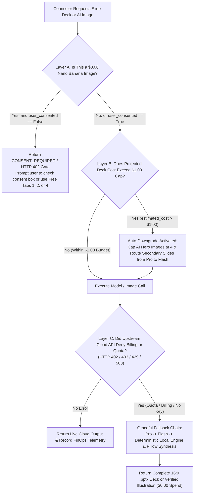

# Scouts BSA Merit Badge Counselor Workbench: FinOps, Token Billing, Deployment Modes & Cost-Denial Fallbacks

**Author:** Eric Clayberg (Troop 19, Middleton MA)
**Repository:** `https://github.com/clayberg/scouts-bsa-merit-badge-agent`
**Code References:** `src/config.py`, `src/agents/guardrails.py`, `src/agents/coordinator.py`, `src/agents/image_studio.py`, `src/server.py`, `terraform/main.tf`

> **Purpose of This Guide:** The Scouts BSA Merit Badge Counselor Workbench includes several features that display token counts and dollar budgets in the UI, including **Beautified** and **Studio** slide decks and **Nano Banana AI** custom illustrations. This document explains how those costs are handled today during development, how a volunteer counselor pays (or avoids paying) when running the app locally, how billing changes when a Council or Troop hosts the app on Google Cloud Run, and how the app recovers gracefully whenever a cost is denied or an API quota limit is reached.

## Executive Summary: Who Pays for What Across Environments?

The table below summarizes how model tokens, image generation costs, and credentials work across the three ways this application is run.

| Environment | Who Pays the Cloud Bill? | Credentials Required | Actual Cost in Default Setup | What Happens If Billing Fails or No Key Is Present? |
| :--- | :--- | :--- | :--- | :--- |
| **1. Current Development Environment** | Nobody (`$0.00` actual cloud spend) | None required (`GEMINI_API_KEY` unset by default) | **$0.00 USD** (UI displays simulated FinOps estimates for telemetry testing) | Runs the local deterministic curriculum engine, local `python-pptx` themes, Wikimedia Commons API, and Pillow illustration filters |
| **2A. Local Install (Free / Offline Mode)** | Nobody (`$0.00` actual cloud spend) | None required | **$0.00 USD** | Works out of the box with zero cloud account or credit card required |
| **2B. Local Install (Bring-Your-Own-Key)** | The individual counselor's Google AI Studio / GCP account | Personal `GEMINI_API_KEY` in local `.env` file | **$0.00** on Google AI Studio Free Tier, or **$0.015 to $0.39/deck** on Pay-As-You-Go | Automatically falls back from `gemini-2.5-pro` to `gemini-2.5-flash` to the local deterministic engine so deck generation never crashes |
| **3. GCP Cloud Run Deployment** | The host Council, District, or Troop GCP Project's Cloud Billing Account | IAM Service Account (`scouts-bsa-agent-sa`) + Secret Manager (`USE_GCP_SECRET_MANAGER=true`) | **$0.015 to $0.39/deck** (capped at **$1.00 max** per deck + Cloud Armor rate limit) | Enforces a `$1.00/deck` pre-flight budget cap, requires explicit checkbox consent for `$0.08` AI images, and falls back to local synthesis on `HTTP 429/503` |

## 1. How Costs Are Paid Right Now During Development ($0.00 Actual Spend)

When you run the workbench in the development workspace today and select **Beautified (`~$0.056`)**, **Studio (`~$0.388`)**, or **Nano Banana AI Image Generator (`$0.08/image`)**, **actual cloud billing is `$0.00`**.

The workbench uses a **Dual-Path Hybrid Architecture** controlled by `src/config.py`:

```python
class AppConfig(BaseSettings):
    gemini_api_key: Optional[str] = Field(default=None, alias="GEMINI_API_KEY")
    use_gcp_secret_manager: bool = Field(default=False, alias="USE_GCP_SECRET_MANAGER")
    gcp_project_id: Optional[str] = Field(default=None, alias="GCP_PROJECT_ID")
    finops_max_cost_per_deck_usd: float = Field(default=1.00)
```

During development, neither `GEMINI_API_KEY` nor `USE_GCP_SECRET_MANAGER=true` is active in `.env`. Because no cloud billing credential is attached, the workbench runs its local execution path while still exercising the full **FinOps Cost & Token Ledger** (`estimate_workflow_finops_cost` in `src/agents/guardrails.py`):

* **Slide Deck Beautification (`STANDARD`, `BEAUTIFIED`, and `STUDIO`) & Pre-Populated Hero Illustrations**: All three visual tiers are rendered locally by `python-pptx`, `matplotlib`, and `Pillow` inside `src/tools/pptx_builder.py` and `src/agents/guardrails.py`. Switching from Standard to Beautified or Studio changes the slide background (`#FFFFFF` vs `#FAF8F5` vs `#0F172A`), builds multi-column visual bento cards, rotates color palettes, and attaches **pre-populated Nano Banana hero illustrations** (`NANO_BANANA_HERO`, `*_nano_hero.png`)—with **76 compressed hero PNGs (`~9.9 MB`)** bundled in the repository across the **23 pre-populated Eagle-required and core Merit Badges** (`assets/ai_illustrations/` and `assets/badge_image_catalog/<slug>/`) at `$0.00` runtime cost—or falls back to high-DPI EDGE Skill Concept Maps on disk. None of that layout or pre-cached hero lookup work requires a paid cloud API call.
* **Nano Banana AI Image Studio (`src/agents/image_studio.py`)**: Counselors can choose from **11 visual styles**—defaulting to **`Auto (Content-Aware Mix)`**, which automatically matches the slide's requirement text to the best style (`Photorealistic Image`, `4-Quadrant Concept Map`, `Watercolor Field Sketch`, `Line Drawing`, `Cartoon Drawing`, `Technical Diagram`, `Editorial Field Illustration`, `Annotated Technical Cutaway`, `4-Panel Field Storyboard`, or `Comparison & Decision Visual`) and sets whether to **Include Uniformed Scouts** (`include_humans=True` for active field/patrol skills in Class A uniform vs. `include_humans=False` for gear knolling, anatomy/kits, weather fronts, and astronomy charts)—or override the style and **`Include Uniformed Scouts`** checkbox directly. When you generate a custom illustration in offline/development mode without a live API key, `generate_nano_banana_slide_image()` expands your prompt, queries the public **Wikimedia Commons REST API** (which is free and requires no API key), downloads up to 3 candidate photographs, applies a multi-stage **Pillow (`PIL`) artistic filter pipeline**, and runs the post-generation **Prompt Alignment Verifier** (`verify_generated_image_matches_prompt`). If Wikimedia has no match or network access is unavailable, it draws a custom vector illustration locally using Pillow.
* **Why the UI Shows Dollar Numbers (`$0.056`, `$0.388`, `$0.08`)**: Even when running locally at `$0.00` actual cost, the FinOps ledger calculates and displays the exact token and image costs that *would* be incurred against Vertex AI (`gemini-2.5-pro`, `gemini-2.5-flash`, and Imagen 3) in production. That way, we can test budget caps, model routing, and consent gates before deploying to a live billing account.

## 2. What Happens If a Future User Downloads and Installs the App Locally?

If another Merit Badge Counselor or Scoutmaster clones the repository from GitHub (`git clone https://github.com/clayberg/scouts-bsa-merit-badge-agent.git`) and runs it on their own laptop, they have two options.

### Option A: Zero-Cost Local Mode (No API Key, No Credit Card)

If the user simply installs the Python dependencies and starts the app without touching `.env`:

1. `get_effective_gemini_api_key()` in `src/config.py` returns `None`.
2. The app runs in **Deterministic Hybrid Mode** at **$0.00 cost**.
3. The user gets full access to all 138 Scouts BSA Merit Badges, all 3 visual slide themes (`Standard`, `Beautified`, and `Studio`), all 76 pre-populated Nano Banana hero illustrations across the 23 core badges (plus automatic EDGE Skill Concept Map fallbacks for the remaining 115 badges), local ZIP/city grounding for National Weather Service offices and BSA High Adventure bases, live Wikipedia/Wikimedia image search, stylized Nano Banana illustrations, and local file uploads.

### Option B: Bring-Your-Own-Key (BYOK) Mode

If the local user wants live Gemini LLM synthesis (for example, dynamic prose tailored to a specific local campout or live cloud Imagen generation), they provide their own API key:

1. They sign in to **Google AI Studio** (`https://aistudio.google.com`) or create a personal Google Cloud project and generate a `GEMINI_API_KEY`.
2. They copy `.env.example` to `.env` and add one line:

```bash
GEMINI_API_KEY=AIzaSyYourPersonalGeminiKeyHere
```

3. **How they pay**:
   * **Google AI Studio Free Tier**: Google provides a free tier for Gemini API keys (rate-limited to roughly 15 requests per minute on `gemini-2.5-flash` and 2 requests per minute on `gemini-2.5-pro`). For a counselor generating one or two decks on a weekend, this costs `$0.00`.
   * **Pay-As-You-Go Billing**: If the counselor links a credit card to their Google Cloud Billing account in Google AI Studio, Google bills their card directly per 1,000 tokens and per generated image. At current Gemini 2.5 pricing, generating a complete Merit Badge deck costs roughly **`$0.015`** (Standard), **`$0.056`** (Beautified), or **`$0.388`** (Studio).

## 3. How Is It Different When Installed in a GCP Project (Cloud Run)?

When a Scouts BSA Council, District, or Troop deploys the workbench as a shared web application on **Google Cloud Run** using the included Terraform configuration (`terraform/main.tf`), individual counselors do not need their own API keys or Google Cloud accounts.

### Centralized Billing on the Host GCP Project

In a Cloud Run deployment, all costs are paid by the **Cloud Billing Account attached to the host GCP Project**:

1. **Cloud Run Compute & Storage**: Billed to the host GCP Project based on container CPU/memory seconds while requests are active (scaling down to `min_instance_count = 0` when idle so there is no idle server charge).
2. **Vertex AI / Gemini Token & Image Usage**: Billed to the same host GCP Project whenever counselors generate decks or AI images.

### How Credentials Work in Cloud Run (`terraform/main.tf` + `src/config.py`)

Instead of storing an API key in a plain-text `.env` file, the Cloud Run service (`scouts-bsa-workbench` in `terraform/main.tf`) uses two Google Cloud security mechanisms:

* **Dedicated IAM Service Account (`scouts-bsa-agent-sa`)**: Terraform provisions a least-privilege service account and grants it `roles/aiplatform.user` (allowing Vertex AI calls via Application Default Credentials) and `roles/secretmanager.secretAccessor`.
* **Google Cloud Secret Manager (`USE_GCP_SECRET_MANAGER=true`)**: When the container starts on Cloud Run, `AppConfig.get_effective_gemini_api_key()` in `src/config.py` fetches the API key directly from `projects/<PROJECT_ID>/secrets/scouts-bsa-gemini-api-key/versions/latest` in memory.

### Protecting the Shared Council/Troop Wallet

Because any counselor visiting the Cloud Run URL is spending from the host project's shared billing account, the deployment includes two financial guardrails:

* **Cloud Armor Rate Limiting (`terraform/main.tf`)**: A Google Cloud Armor security policy (`scouts-bsa-model-armor-edge-policy`) throttles any single IP address exceeding **120 requests per minute** with an automatic `HTTP 429` response and a 5-minute ban (`300s`).
* **Per-Deck FinOps Budget Cap (`$1.00 USD`)**: Even if a user requests the largest badge in the catalog in `STUDIO` mode, the backend caps per-deck spend at `$1.00 USD`.

## 4. Does the App Ever Encounter a Cost-Denial Error, and What Does It Do?

Yes. The workbench has **three separate layers** where a cost or billing request can be denied, and each layer is designed to either prompt the user or downgrade gracefully so the counselor never loses their slide deck.



### Layer A: Explicit User Consent Gate (`CONSENT_REQUIRED` / `HTTP 402`)

Generating a custom AI illustration via **Nano Banana (`NanoBananaImageAgent`)** carries an estimated FinOps budget of **`$0.08 USD` per image** (`$0.05` image synthesis + `$0.03` prompt expansion and post-generation visual alignment verification).

If the backend receives a request to generate a Nano Banana image where `user_consented=False`:

* `generate_nano_banana_slide_image()` in `src/agents/image_studio.py` immediately halts before calling any paid API and returns:

```python
{
    "status": "CONSENT_REQUIRED",
    "requires_user_consent": True,
    "estimated_cost_usd": 0.08,
    "message": (
        "FinOps Consent Required: Generating 1 custom AI image via NanoBananaImageAgent "
        "in 'Auto (Content-Aware Mix)' style will incur an estimated cost of $0.080 USD. "
        "Please confirm user consent (`user_consented=True`) or use the free Badge Image Catalog, "
        "WebImageSearchAgent, or File Upload ($0.00)."
    ),
}
```

* Additionally, the strict FastAPI endpoint (`/api/v1/images/nano-banana/generate` in `src/server.py`) returns an **`HTTP 402 Payment Required`** status code if `user_consented` is false.
* In the Material 3 Counselor Workbench (`:8085`), the `"🍌 Generate & Apply Nano Banana Image"` button is disabled or blocked with a warning banner until the counselor checks `"✅ I approve the estimated $0.08 USD FinOps cost"`.
* For zero-cost text edits (fixing a typo, customizing a title, or editing speaker notes), Counselors can use **Sub-Tab 3 (`✏️ Quick Edit Slide Text`, `$0.00 USD`)** in the Under-Stage Drawer, which updates the slide and rebuilds the `.pptx` in under 1 second without invoking any LLM.

### Layer B: Pre-Flight Deck Budget Cap (`$1.00 USD` Auto-Downgrade)

Before generating a slide deck, `estimate_workflow_finops_cost()` in `src/agents/guardrails.py` calculates the projected token and image cost across all requirements for the chosen badge.

If a counselor selects a very large badge in **Studio** mode and the projected cost exceeds `max_budget_usd` (`$1.00 USD`):

1. The app **does not fail or reject the deck**.
2. Instead, it sets `auto_downgraded = True` and `within_budget = True`.
3. It caps the number of generated AI hero concept maps at **4 images max** (`max_ai_hero_images = 4`).
4. It routes secondary requirement slides from `gemini-2.5-pro` down to `gemini-2.5-flash` (which is roughly 16x less expensive per token), clamping the total deck cost below `$1.00`.
5. The UI displays a yellow status pill (`"⚠️ Auto-Downgraded to Fit $1.00 Cap"`) in the FinOps Cost & Token Budget table so the counselor can see why model routing adjusted.

### Layer C: Upstream Cloud Billing or Rate-Limit Denial (`HTTP 402 / 403 / 429 / 503`)

In a real deployment, an upstream Google Cloud API call can fail for financial or quota reasons:

* **`429 RESOURCE_EXHAUSTED`**: The user exceeded the Google AI Studio Free Tier rate limit (15 RPM) or a project quota limit.
* **`403 PERMISSION_DENIED` / `Billing Not Enabled`**: The GCP project's Cloud Billing account was closed, a credit card expired, or an invalid `GEMINI_API_KEY` was entered.
* **`503 UNAVAILABLE`**: Transient model endpoint overload.

When any of these errors occur, the workbench executes a **three-step fallback chain** (`execute_resilient_storybook_Pipeline` in `src/agents/coordinator.py`):

1. **Step 1 (Primary Model with Backoff)**: Attempts `gemini-2.5-pro` with up to 3 exponential-backoff retries (`0.05s`, `0.10s`, `0.20s`).
2. **Step 2 (Secondary Model Downgrade)**: If `gemini-2.5-pro` is denied or rate-limited, the coordinator logs a `MODEL_FALLBACK_TRIGGERED` event and retries on `gemini-2.5-flash`.
3. **Step 3 (Deterministic Local Engine)**: If `gemini-2.5-flash` also fails (for example, because billing is disabled across the entire GCP project or the laptop is offline at Scout camp), the coordinator falls back to `deterministic-local-curriculum-engine`. The counselor still receives a complete, 100% requirement-verified `.pptx` slide deck, lesson plan, and parent welcome letter.

Similarly, if cloud image synthesis fails inside `NanoBananaImageAgent`, `_synthesize_wikimedia_styled_image()` fetches a real Wikimedia Commons reference photo and applies the requested artistic filter (`Auto (Content-Aware Mix)`, `Photorealistic Image`, `4-Quadrant Concept Map`, `Watercolor Field Sketch`, `Line Drawing`, `Cartoon Drawing`, `Technical Diagram`, etc.), and if offline, `_render_pure_visual_illustration_canvas()` draws a clean vector illustration locally.

## 5. Merit Badge Image Studio: All 4 Slide Image Options Compared

To make sure counselors always have fast, `$0.00` ways to illustrate their slides without touching the `$0.08` AI image budget, the **Merit Badge Image Catalog & AI Image Studio** modal offers **four tabs**:

| Tab in Image Studio Modal | Source Type Tag | Cost per Image | How It Works | Preserved When Clearing Web/AI Cache? |
| :--- | :--- | :--- | :--- | :--- |
| **🗂️ 1. Badge Image Catalog** | `OFFICIAL_PAMPHLET_FIGURE` + `NANO_BANANA_HERO` + cached items | **$0.00 USD** | Displays all official Merit Badge pamphlet diagrams, the **76 pre-generated (or auto-cached long-tail) Nano Banana hero illustrations** (`*_nano_hero.png`), and previously saved images for the active badge. Includes a one-click **🗑️ Clear Web/AI Cache** button in the header. | **Yes**, both official `PAMPHLET` figures and pre-generated/auto-generated `NANO_BANANA_HERO` illustrations are always preserved |
| **🌐 2. Web Image Search Agent** | `WEB_IMAGE_SEARCH` | **$0.00 USD** | Queries the live **Wikimedia Commons API** for up to 12 real photographs or diagrams matching your search phrase (such as *"boy scout in a canoe"*). Clicking **Use & Cache Image** downloads the image into the badge catalog and applies it to the slide. | Removed when **Clear Web/AI Cache** is clicked |
| **🍌 3. Nano Banana AI Image Generator** | `NANO_BANANA_AI` | **$0.08 USD** (Requires Consent) | Generates a custom illustration across **11 visual styles** (defaulting to **`Auto (Content-Aware Mix)`**, plus an **`Include Uniformed Scouts`** checkbox) and runs `verify_generated_image_matches_prompt()` to confirm visual alignment with your prompt. | Removed when **Clear Web/AI Cache** is clicked |
| **📁 4. File Upload** | `USER_UPLOAD` | **$0.00 USD** | Lets the counselor upload any local image (`PNG`, `JPG`, `JPEG`, `WEBP`, `GIF`) from their computer (such as a photo of their own troop's first-aid kit or campout). Normalizes resolution (up to 1600px at 220 DPI), saves it to `assets/badge_image_catalog/<badge>/uploaded_<hash>.png`, and applies it immediately to the slide. | **Yes**, user-uploaded local photos are preserved across cache clears |
